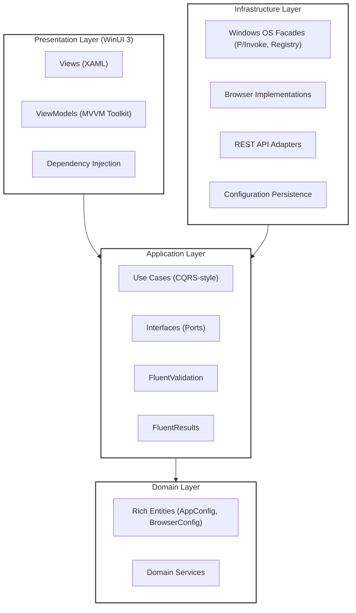

# eBRestarter

**A robust, automated orchestration tool for the eBesucher Surfbar, built with Clean Architecture, DDD principles, and WinUI 3.**


## Overview

eBRestarter is a desktop application designed to ensure continuous, stable operation of the eBesucher Surfbar by automating browser restarts, managing system resources, and clearing cache/cookies. 

This project was built to demonstrate professional-level competency in modern C# development, showcasing **Clean Architecture**, **Domain-Driven Design (DDD)**, and **SOLID principles** within a Windows desktop environment.

## Architecture

The application is structured using **Clean Architecture**, separating the core business rules from infrastructure and UI concerns.



### Key Architectural Decisions

1. **Clean Architecture & Dependency Inversion:** The Core project has zero dependencies on the UI or Infrastructure. All OS-level interactions (Registry, Process Management, File System) are abstracted behind interfaces in the Application layer and implemented in the Infrastructure layer.
2. **Rich Domain Model:** Configuration settings (`AppConfig`, `Computer`, `BrowserConfig`) are modeled as Domain Entities with encapsulated state and built-in business logic (e.g., calculating next restart dates).
3. **Result Pattern:** The Application layer uses `FluentResults` to avoid exception-driven control flow. Use Cases return `Result<T>` instead of throwing exceptions, ensuring robust error handling.
4. **Validation:** `FluentValidation` is used to validate all Use Case requests before execution.
5. **MVVM Pattern:** The WinUI 3 frontend strictly adheres to MVVM, utilizing the `CommunityToolkit.Mvvm` for source-generated properties and commands. God classes have been refactored into smaller, focused ViewModels.

## Tech Stack

- **Framework:** .NET 10.0
- **UI:** WinUI 3 (Windows App SDK)
- **Architecture:** Clean Architecture, DDD
- **Libraries:**
  - `CommunityToolkit.Mvvm` (State management)
  - `FluentResults` (Error handling)
  - `FluentValidation` (Request validation)
  - `RestSharp` (API communication)
  - `Moq` & `Shouldly` (Testing)
- **Testing:** xUnit (35+ test files covering Use Cases, Domain logic, and Infrastructure adapters)

## Getting Started (Developers)

### Prerequisites
- Windows 11 (64-bit)
- Visual Studio 2022 (latest preview for .NET 10 support) or JetBrains Rider
- Windows App SDK workload installed

### Building the Project
1. Clone the repository.
2. Open `eBRestarter.sln` in Visual Studio.
3. Set `eBRestarter.Desktop.WinUI3` as the startup project.
4. Build and run (F5).

### Running Tests
The project includes a comprehensive test suite located in `eBRestarter.XUnit.Test`.
Run the tests via the Visual Studio Test Explorer or using the .NET CLI:
```bash
dotnet test
```
*Note: The test suite uses `Microsoft.Extensions.Time.Testing.FakeTimeProvider` to deterministically test time-based background tasks without actual delays.*

## Features

- **Automated Browser Orchestration:** Starts, monitors, and gracefully closes Chromium/Firefox browsers.
- **System Cleanup:** Automatically clears browser cache and cookies based on a configurable schedule.
- **Process Monitoring:** Detects browser crashes and initiates cooldown/restart cycles.
- **OS Integration:** Manages Windows Auto-Logon and Startup settings via Registry and P/Invoke.
- **API Integration:** Connects to the eBesucher REST API to fetch live earning statistics.

---
*Disclaimer: eBRestarter is an unofficial tool and is not affiliated with eBesucher GmbH.*
