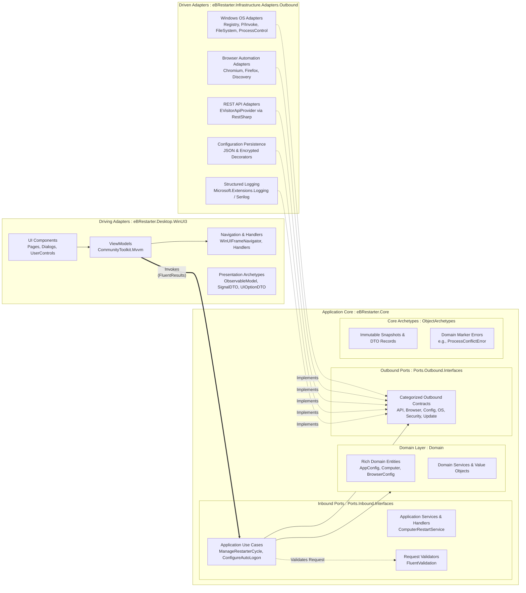

# eBRestarter

**A robust, automated orchestration tool for the eBesucher Surfbar, built with Hexagonal (Ports and Adapters) Architecture, DDD principles, and WinUI 3.**


## Overview

eBRestarter is a desktop application designed to ensure continuous, stable operation of the eBesucher Surfbar by automating browser restarts, managing system resources, and clearing cache/cookies. 

This project was built to demonstrate professional-level competency in modern C# development, showcasing **Clean Architecture**, **Domain-Driven Design (DDD)**, and **SOLID principles** within a Windows desktop environment.

## Architecture

The application is structured using **Ports and Adapters (Hexagonal Architecture)** / **Clean Architecture**, separating the core business rules from infrastructure and UI concerns. Following modern DDD and SOLID principles, all layers clearly distinguish their data structures using explicit **Object Archetypes** (`DTOs`, `Records`, `ObservableModels`, and `TypedErrors`).



### Key Architectural Decisions & Structure

1. **Strict Hexagonal Separation (`Ports` & `Adapters`):**
   - **Inbound Ports (`eBRestarter.Core.Application.Ports.Inbound.Interfaces`):** Define the entry points into the core business logic (`UseCases`, `Services`, `Handlers`, `Providers`, `Validators`).
   - **Outbound Ports (`eBRestarter.Core.Application.Ports.Outbound.Interfaces`):** Define modular interfaces categorized by domain capability (`API`, `Browser`, `Config`, `OperatingSystem`, `Security`, `Update`).
   - **Driven Adapters (`eBRestarter.Infrastructure.Adapters.Outbound`):** Provide concrete implementations for each outbound port (`WindowsOS`, `Browsers`, `API`, `Http`, `Logging`).
2. **Explicit Object Archetypes (`ObjectArchetypes/`):**
   Instead of mixing arbitrary data classes, models across all layers are structured into semantic archetypes (detailed in `Csharp_Models_Vergleich.md`):
   - **Immutable Snapshots / DTO Records:** Positional and `init`-only records used for data transfer across boundaries.
   - **Observable UI Models:** Presentation models inheriting from `ObservableObject` (`[ObservableProperty]`) in WinUI 3.
   - **Signal DTOs / Event Messages:** Lightweight records used for decoupled ViewModel pub-sub communication (`WeakReferenceMessenger`).
   - **Typed Errors / Marker Types:** Strongly-typed errors (such as `ProcessConflictError`) enabling clean C# pattern matching instead of string parsing.
3. **Rich Domain Model:** Configuration settings (`AppConfig`, `Computer`, `BrowserConfig`) are modeled as encapsulated Domain Entities with rich domain behavior.
4. **Railway Oriented / Result Pattern:** The Application layer uses `FluentResults` (`Result<T>`) across all Use Cases and Adapters, eliminating fragile exception-driven flow control.
5. **Clean Presentation Layer:** The WinUI 3 desktop UI strictly adheres to MVVM, delegating navigation to explicit navigators (`WinUIFrameNavigator`) and organizing UI-specific options and messages into presentation archetypes.

## Tech Stack

- **Framework:** .NET 10.0
- **UI:** WinUI 3 (Windows App SDK)
- **Architecture:** Clean Architecture, DDD
- **Libraries:**
  - `Microsoft.Extensions.Hosting` (Dependency Injection & Background Services)
  - `CommunityToolkit.Mvvm` (State management)
  - `FluentResults` (Result Pattern & Error handling)
  - `FluentValidation` (Request validation)
  - `Serilog` (Structured enterprise logging)
  - `LiveChartsCore` (Data visualization & dashboards)
  - `RestSharp` (API communication)
  - `Moq` & `Shouldly` (Testing)
- **Testing:** xUnit (45+ test files covering Use Cases, Domain logic, and Infrastructure adapters)

## Getting Started (Developers)

### Prerequisites
- Windows 11 (64-bit)
- Visual Studio 2026 (for .NET 10)
- Windows App SDK workload installed

### Building the Project
1. Clone the repository.
2. Open `eBRestarter.sln` in Visual Studio.
3. Set `eBRestarter.Desktop.WinUI3` as the startup project.
4. Build and run (F5).

### Running Tests
The project includes a comprehensive test suite located in `eBRestarter.XUnit.Test`.
Run the tests via the Visual Studio Test Explorer or using the .NET CLI:
```bash
dotnet test
```
*Note: The test suite uses `Microsoft.Extensions.Time.Testing.FakeTimeProvider` to deterministically test time-based background tasks without actual delays.*

## Features

- **Automated Browser Orchestration:** Starts, monitors, and gracefully closes Chromium/Firefox browsers.
- **System Cleanup:** Automatically clears browser cache and cookies based on a configurable schedule.
- **Process Monitoring:** Detects browser crashes and initiates cooldown/restart cycles.
- **OS Integration:** Manages Windows Auto-Logon and Startup settings via Registry and P/Invoke.
- **API Integration & Analytics:** Connects to the eBesucher REST API to fetch and visualize live earning statistics, network traffic, and IP information on modern dashboards.

---
*Disclaimer: eBRestarter is an unofficial tool and is not affiliated with TurboAd GmbH.*
